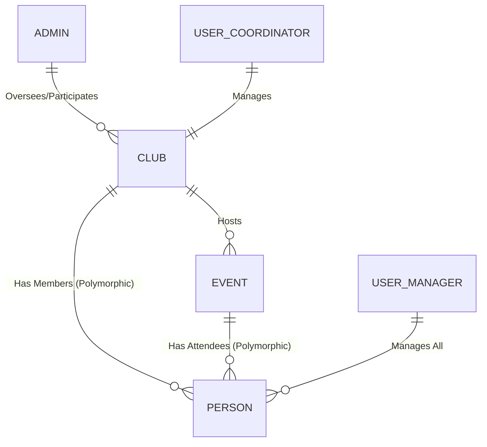

# ClubApp - Technical Project Overview

## 1. Introduction
**ClubApp** is a robust, custom-built Dynamic Club Management System developed in Java. It provides a structured environment for managing academic or social clubs, scheduling events, and tracking student participation. The system is designed with a strong emphasis on **role-based access control** and **polymorphic participation**.

---

## 2. Design Rationale: "Built from Scratch"
The decision to implement core functionalities from scratch was driven by:
- **Zero External Dependencies**: Self-contained and portable.
- **Granular Control over Persistence**: Human-readable `.txt` data format.
- **Performance & Simplicity**: Fast startup and low memory overhead.
- **Professional Integrity**: custom object-relational mapping and state management.

---

## 3. Java Collections & Polymorphism
### 3.1. Collections Usage
- **`ArrayList<T>`**: Used for `clubs`, `events`, `members`, and `attendees`.
- **Rationale**: Provides $O(1)$ retrieval by index and handles dynamic resizing as the system grows.

### 3.2. Polymorphic Participation
The system has been refactored to use the **`Person`** base class for all club-related lists.
- **Why?**: This allows the **Admin** role (which inherits from `Person`) to participate in activities typically reserved for Students (joining clubs) and Coordinators (adding events), while keeping the core identity logic separate.

---

## 4. Role Hierarchy & Functionality
The system supports three primary roles with a dynamic permissions model:

### 4.1. Role Permissions Matrix
| Function | Admin | Coordinator | Student |
| :--- | :---: | :---: | :---: |
| **View All Clubs** | ✅ | ✅ | ✅ |
| **View Club Events** | ✅ | ✅ | ✅ |
| **Join Club** | ✅ | - | ✅ |
| **Register for Event** | ✅ | - | ✅ |
| **Add Event** | ✅ | ✅ | - |
| **Update/Remove Event** | ✅ | ✅ | - |
| **Create New Club** | ✅ | - | - |
| **Delete Entries** | ✅ | - | - |

### 4.2. Detailed Role Capabilities
- **Admin**: The super-user with full lifecycle control over the system. They can create new clubs, delete clubs, manage events (Add, Update, Remove), and participate as members/attendees. They oversee all club operations and maintain system integrity.
- **Coordinator**: Assigned to a specific club. They have mid-level authority to manage their club's schedule (Add, Update, Remove Events) and details.
- **Student**: The primary participants. They can browse clubs, join them, and register for specific events scheduled by Coordinators or Admins.

---

## 5. Component Breakdown
### 5.1. `clubApp.java` (UI Controller)
- **`clubInteractionMenu`**: A shared, context-aware menu that dynamically adjusts available options based on the user's role and the club being viewed.

### 5.2. `clubs` Package
- **`Club.java`**: Stores a `List<Person>` for members, allowing polymorphic membership.
- **`Event.java`**: Tracks a `List<Person>` for attendees.
- **`ClubManager.java`**: Manages the global state and cross-references user emails (Admins, Coordinators, or Students) to the correct `Person` object.

---

## 6. System Relationships

---

## 7. Data Persistence
Persistent storage is handled via pipe-delimited (`|`) files in the `file/` directory:
- **`users.txt`**: `ROLE|Name|Email|Password`
- **`clubs.txt`**: `ClubName|Description|CoordinatorEmail`
- **`events.txt`**: `ParentClub|EventName|Desc|Venue|Date`
- **`members.txt`**: `ClubName|MemberEmail`
- **`event_registrations.txt`**: `ClubName|EventName|AttendeeEmail`

---

## 8. Summary of Custom Features
| Feature | Implementation | Benefit |
| :--- | :--- | :--- |
| **Context-Aware UI** | Dynamic menu branching | Clean UX with enforced restrictions. |
| **Duplicate Prevention** | Manager-level validation | Ensures data uniqueness for Admins, Clubs, and Events. |
| **Reference Resolution** | Custom mapping during load | Ensures "Single Source of Truth" in memory. |
